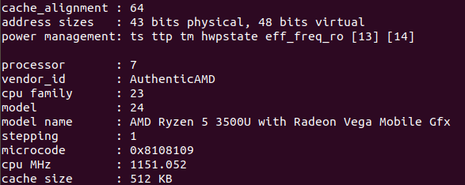
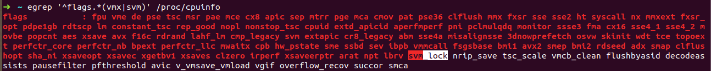
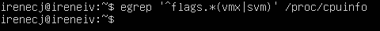
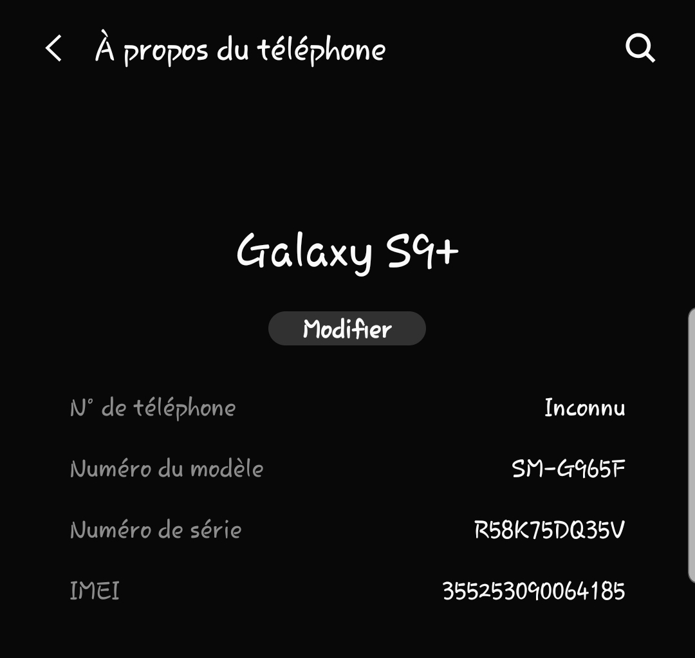

## EJERCICIOS DE AUTOEVALUACIÓN IV - TEMA 1

**Ejercicio 1.** Consultar en el catálogo de alguna tienda de informática el precio de un ordenador tipo servidor y calcular su coste de amortización a cuatro y siete años. [Consultar este artículo en Infoautónomos sobre el tema.](http://infoautonomos.eleconomista.es/consultas-a-la-comunidad/988/)

En primer lugar debemos elegir un servidor. Para ello yo he decidido buscarlo en [PcComponentes](https://www.pccomponentes.com/) y me he quedado con [este](https://www.pccomponentes.com/hpe-proliant-ml30-intel-xeon-e-222416gb-reacondicionado), cuyo precio vemos que es 1043,35€.

A continuación he buscado la tabla de coeficientes de amortización lineal, la cual podemos encontrar en la [Agencia Tributaria.](https://www.agenciatributaria.es/AEAT.internet/Inicio/_Segmentos_/Empresas_y_profesionales/Empresas/Impuesto_sobre_Sociedades/Periodos_impositivos_a_partir_de_1_1_2015/Base_imponible/Amortizacion/Tabla_de_coeficientes_de_amortizacion_lineal_.shtml)

Procedemos a calcular los costes de amortización:
* En un periodo de 4 años como queremos amortizar nuestro servidor al 100% tendremos un coeficiente de amortización equivalente a 100/4 obteniendo un 25% de amortización que coincide con el coeficiente lineal máximo. Por tanto en dicho periodo tendremos una amortización de 260,8375€ al año.
* En un periodo de 7 años obtenemos un coeficiente de amortización del 14,29%, por lo que tendremos una amortización de 149,09€ al año.

**Ejercicio 2.** Usando las tablas de precios de servicios de alojamiento en Internet "clásicos", es decir, que ofrezcan *Virtual Private Servers* o servidores físicos, y de proveedores de servicios en la nube, comparar el coste durante un año de un ordenador con un procesador estándar (escogerlo de forma que sea el mismo tipo de procesador en los dos vendedores) y con el resto de las características similares (tamaño de disco duro equivalente a transferencia de disco duro) en el caso de que la infraestructura comprada se usa solo el 1% o el 10% del tiempo.

Comenzamos buscando una página que nos ofrezca [VPS](https://axarnet.es/vps?gclid=EAIaIQobChMI5YO41aaW7AIV1OFRCh1E6ANeEAAYASAAEgKHI_D_BwE) y otra de proveedores de servicios en la [nube.](https://clouding.io/lp-ppc/cloud-server?gclid=EAIaIQobChMI4-GY8qWW7AIV1YjVCh1FvALiEAAYASAAEgJQU_D_BwE)

|       | Virtual Private Server | Cloud |
| --- | -- | -- |
| **Memoria RAM** | 4GB | 4GB |
| **Capacidad SSD** | 50GB | 60GB |
| **Procesador** | 2 cores | 2 cores |

En el caso de VPS si nos suscribimos durante 1 año nos cobran 16,02€ al mes por lo que pagaríamos 192,24€ / año lo usemos la cantidad de tiempo que sea. En el caso del servidor en la nube nos cobran 0,022€ la hora y aquí tenemos que hacer dos cálculos:
* Si se usa sólo el 1% del tiempo, lo usaremos un total de 87'6 horas, por tanto pagaremos un total de 1,9272€ / año.
* Si se usa el 10% del tiempo (876 horas) pagaremos 19,272€ al año.

Si calculamos cuánto debemos pagar si usamos el servidor un 50% (96,36€ / año) del tiempo, un 70% (134,904€/año) y un 90% (173,448€ / año), de donde podemos concluir que siempre resultará más económico tener el servicio en la nube.

**Ejercicio 3.** En general, cualquier ordenador con menos de 5 o 6 años tendrá estos flags. ¿Qué modelo de procesador es? ¿Qué aparece como salida de esa orden? Si usas una máquina virtual, ¿qué resultado da? ¿Y en una Raspberry Pi o, si tienes acceso, el prcesador del móvil?

Vamos a comenzar viendo que modelo de procesador tiene nuestro ordenador, para ello ejecutamos el siguiente comando:
~~~
cat /proc/cpuinfo
~~~
Y obtenemos el siguiente resultado:

A continuación ejecutamos la orden que nos indican:
~~~
egrep '^flags.*(vmx|svm)' /proc/cpuinfo
~~~

Y nos aparece como salida:

Podemos ver como tenemos activado el flag para AMD-V que permite la virtualización en mi ordenador.

Ahora vamos a probar a ejecutar dicha orden en una máquina virtual y después en mi móvil.

En VirtualBox he creado una máquina con Ubuntu como Sistema Operativo y vemos que el comando no muestra nada por pantalla.

Aquí podemos ver que mi móvil es un Samsung S9+.

Y si ejecutamos la orden vemos que no lista nada por lo que el procesador de mi móvil no tiene dicha funcionalidad o está desactivada.

**Ejercicio 4.** Instalar un hipervisor para gestionar máquinas virtuales, que más adelante se podrá usar en pruebas y ejercicios. Usar siempre que sea posible un hipervisor que sea software libre.

En mi caso ya tengo instalado VirtualBox que es un hipervisor para gestionar máquinas virtuales de software libre el cual he tenido que utilizar en otras asignaturas.

De todas formas adjunto un [enlace](https://vivaubuntu.com/instalar-virtualbox-en-ubuntu-18-04/) donde se explica la instalación de VirtualBox, aunque hay muchos otros tutoriales en Internet.

**Ejercicio 5.** Darse de alta en una web que permita hacer pruebas con alguno de los sistemas de gestión de nube libres como los mencionados en los párrafos anteriores, aunque sea temporalmente. Si la prueba es menos de un mes, simplemente anotarlo y dejarlo para el mes de diciembre, más o menos.

Después de buscar un poco por Internet he decidido usar [Microsoft Azure](https://azure.microsoft.com/en-us/free/search/?&ef_id=EAIaIQobChMIk_nGmNCa7AIVlu5RCh36SwJdEAAYAiAAEgIxkPD_BwE:G:s&OCID=AID2100112_SEM_EAIaIQobChMIk_nGmNCa7AIVlu5RCh36SwJdEAAYAiAAEgIxkPD_BwE:G:s) pero éste sólo tiene gratuitos 30 días, por tanto me registraré más adelante.
