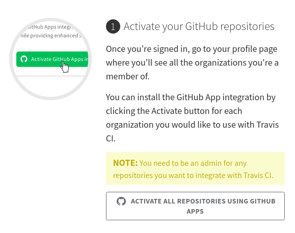
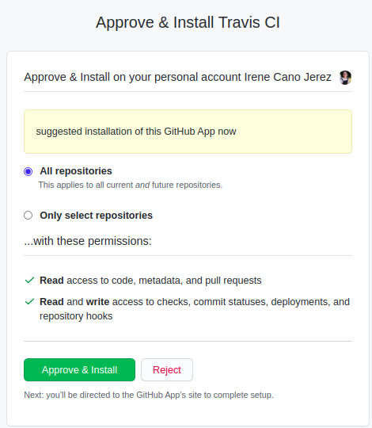
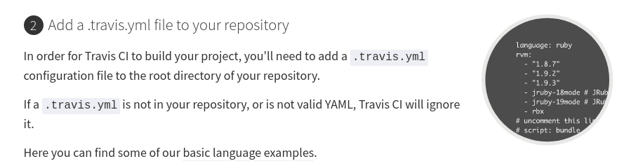
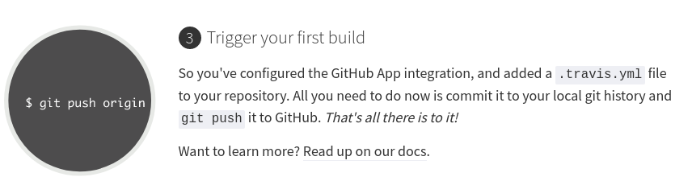
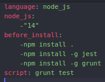
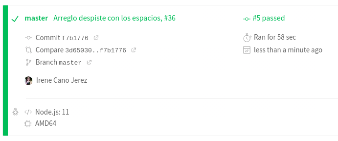

## EJERCICIOS DE AUTOEVALUACIÓN IV - TEMA 4

### AÑADIENDO INTEGRACIÓN CONTINUA

**Ejercicio 9:** Haced los dos primeros pasos antes de pasar al tercero.
**Ejercicio 10:** Configurar integración contínua para nuestra aplicación usando Travis o algún otro sitio.

*1. Darse de alta. Muchos están conectados con GitHub por lo que puedes autetificarte directamente desde ahí. A través de un proceso de autorización, puedes acceder al contenido e incluso informar del resultado de los tests a GitHub.*

En nuestro caso vamos a escoger **Travis**. Para darnos de alta simplemente debemos acceder a su [página web.](https://travis-ci.com/signin)
Una vez ahí, le damos a *Sign in with GitHub* y nos pedirá autorización para registrarnos con nuestra cuenta de GitHub.

*2. Activar el repositorio en el que se vaya a aplicar la integración continua. Travis permite hacerlo directamente desde tu configuración; en otros se dan de alta desde la web de GitHub.*

Hecho esto, la página nos muestra una serie de pasos que debemos seguir.
1. La realización del primer paso es tan sencilla como darle a *Activate all repositories using GitHub Apps*, seleccionamos todos nuestros repositorios y aceptamos e instalamos.
   

   

2. El segundo paso nos indica que debemos agregar un archivo de configuración, llamado *.travis.yml*, que deberá estar situado en el directorio raíz de nuestro repositorio.
   

3. Finalmente, debemos enviar nuestro fichero de configuración desde el repositorio local a nuestro repositorio en GitHub haciendo uso de *git push*.

*3. Crear un fichero de configuración para que se ejecute la integración y añadirlo al repositorio*

Así queda nuestro fichero de configuración:

Como vemos el fichero contiene diferentes secciones:
- *Language:* indica qué lenguaje estamos usando, en nuestro caso *nodejs*.
- *node_js:* indica las versiones que vamos a probar, en este caso vamos a probar con la 11.
- *before_install:* esta sección se ejecuta antes de la instalación de la aplicación, en nuestro caso antes de *npm install . *. Aquí debemos instalar Jest, usado para las pruebas de testeo, y el gestor de tareas, Grunt.
- *script:* procedemos a la ejecución de nuestros tests.

Finalmente, cada vez que hacemos *push*, Travis comienza a testear, y una vez pasamos el test nos aparece lo siguiente:

En mi caso, vemos que nos indica que ha habido 5 errores, esto se debe a despistes varios, como no haber puesto espacios después de los guiones.
