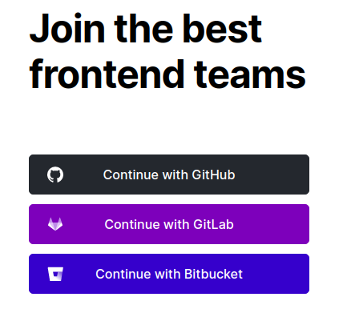
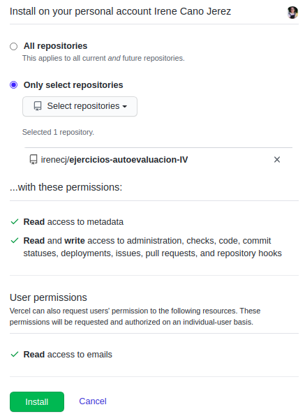
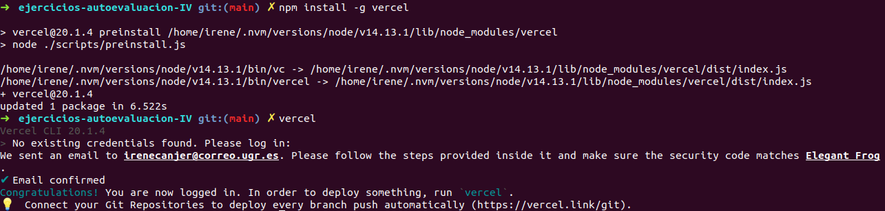
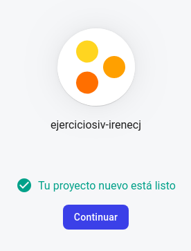

## EJERCICIOS DE AUTOEVALUACIÓN IV - TEMA 5

### SERVERLESS COMPUTING
**Ejercicio 1: ** Darse de alta en Vercel y Firebase y descargarse los SDKs para poder trabajar con ellos localmente.

#### VERCEL
Para registrarnos en **Vercel** simplemente debemos vincular nuestra cuenta de GitHub y a continuación, importamos nuestro repositorio.

Lo próximo que debemos hacer es instalar Vercel con el siguiente comando:
~~~
npm install -g vercel
~~~

Y ejecutamos el programa con:
~~~
vercel
~~~

Y nos pedirá que introduzcamos nuestro correo electrónico para confirmar que es nuestra cuenta.

Y aquí tenemos nuestro perfil en Vercel:

#### FIREBASE
Para registrarnos en **Firebase** debemos comenzar creando un proyecto y dándole un nombre.

