## EJERCICIOS DE AUTOEVALUACIÓN IV - TEMA 5

### SERVERLESS COMPUTING
**Ejercicio 1:** Darse de alta en Vercel y Firebase y descargarse los SDKs para poder trabajar con ellos localmente.

#### VERCEL
Para registrarnos en **Vercel** simplemente debemos vincular nuestra cuenta de GitHub y a continuación, importamos nuestro repositorio.

Lo próximo que debemos hacer es instalar Vercel con el siguiente comando:
~~~
npm install -g vercel
~~~

Y ejecutamos el programa con:
~~~
vercel
~~~

Y nos pedirá que introduzcamos nuestro correo electrónico para confirmar que es nuestra cuenta.

Y aquí tenemos nuestro perfil en Vercel:

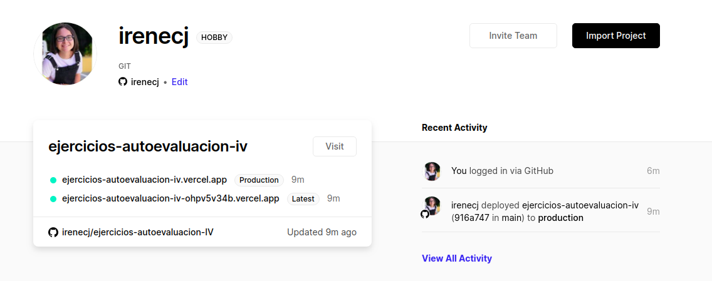

#### FIREBASE
Para registrarnos en **Firebase** debemos comenzar creando un proyecto y dándole un nombre.

Para instalar el **SDK** simplemente debemos ejecutar el siguiente comando:
~~~
npm install -g firebase-tools
~~~

**Ejercicio2:** Tomar alguna de las funciones de prueba de Vercel y hacer despliegues de prueba con el mismo.
Vamos a sacar un ejemplo de la [propia página](https://vercel.com/docs/serverless-functions/supported-languages#ruby) de Vercel, y en nuestro caso elegimos como lenguaje de programación Node ya que es el que estamos usando para el proyecto.

Tal y como se indica en la página, creamos el directorio **api** y dentro de éste el fichero **hello.js**.

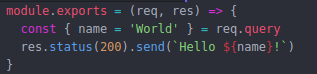

A continuación debemos hacer **push** a nuestro repositorio y debemos desplegarlo con el comando:
~~~
vercel --prod
~~~

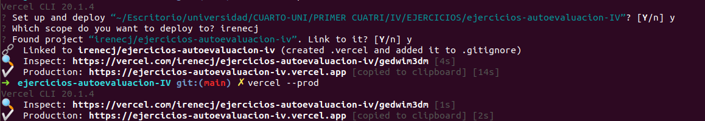

Por último, si hacemos click en el siguiente [enlace](https://ejercicios-autoevaluacion-iv-flgi8qm72.vercel.app/api/hello.js) vemos como se ejecuta correctamente.

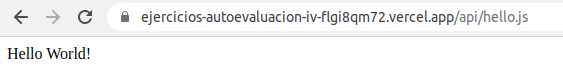

**Ejercicio 3:** tomar alguna de las funciones de prueba de Netlify, y hacer despliegues de prueba con el mismo.

En primer lugar, debemos darnos de alta en Netlify vinculando nuestra cuenta de GitHub.

Ahora tenemos que instalar el SDK y proceder a loguearnos, con los siguientes comandos:
~~~
npm install -g netlify-cli

netlify login
~~~

Cuando hacemos esto nos pide que le demos autorización para así terminar el proceso de logueo.

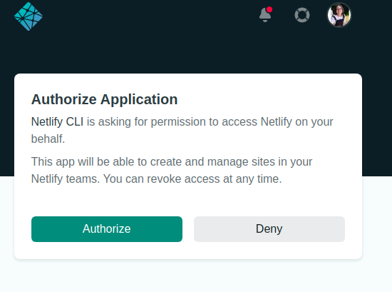

Lo siguiente que debemos hacer es vincular nuestro repositorio y ejecutar:
~~~
netlify deploy

netlify deploy --prod
~~~

A continuación nos vamos a nuestro proyecto, le damos a *Deploy Settings > Functions > Edit Settings* e indicamos que las funciones que vamos a probar se encuentran en el directorio **functions**, el cual se va a situar en la raíz del proyecto, donde también crearemos un fichero **netlify.toml** en el que indicaremos el directorio donde se encuentran nuestras funciones.

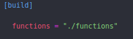

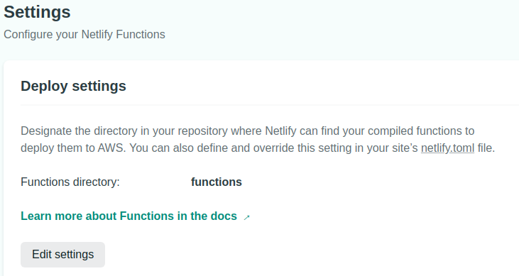

En dicho proyecto vamos a tener una función llamada **hello.js** la cual hemos obtenido de esta [página](https://functions-playground.netlify.app/) donde encontramos varios ejemplos de funciones para probar Netlify.

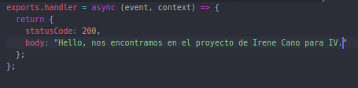

Lo siguiente que debemos hacer es un **push** a nuestro repo y si nos vamos a la plataforma y le damos a *deploy* veremos que ya se ha desplegado el proyecto.

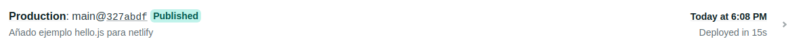

Si accedemos a *functions* veremos que nos aparecen las funciones que hemos añadido al directorio **functions**.

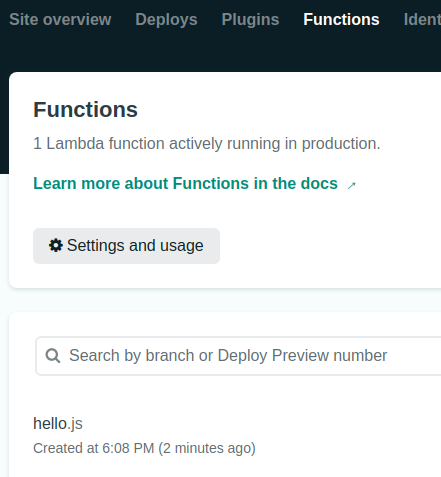

Si clickamos en dicha función, nos aparecerá el log de nuestra función y además se nos proporciona un [enlace](https://ejerciciosiv.netlify.app/.netlify/functions/hello) al cual podemos acceder para ver si nuestra función funciona correctamente.

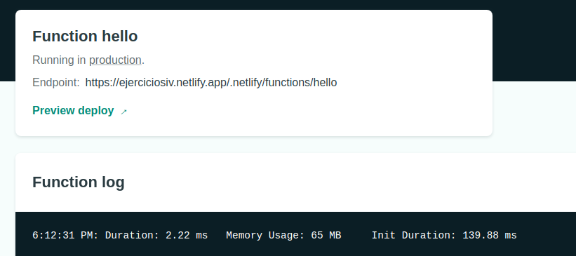

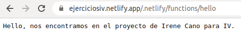
