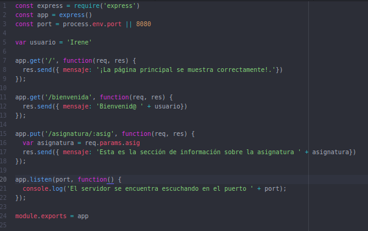
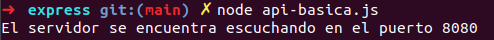
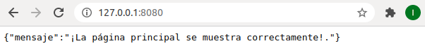
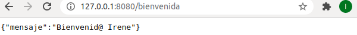
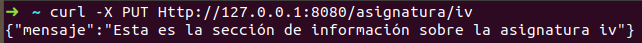
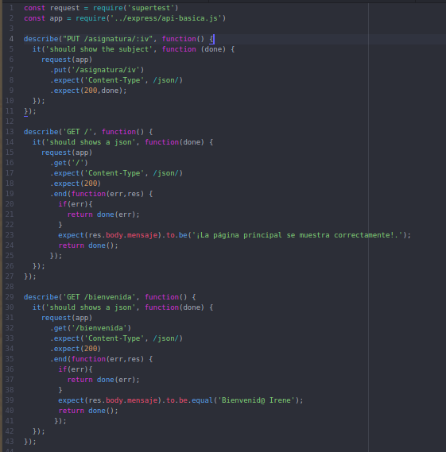
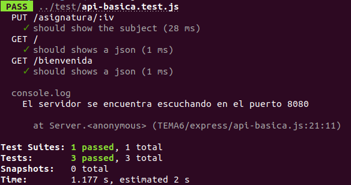
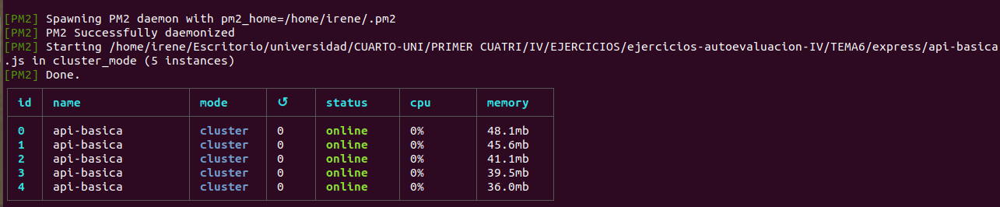
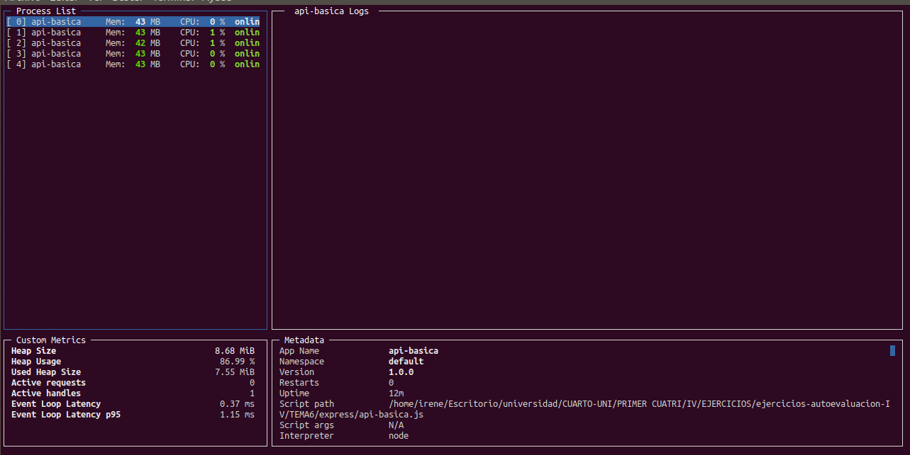
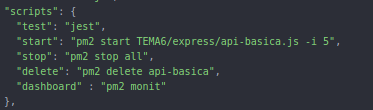

# EJERCICIOS DE AUTOEVALUACIÓN IV - TEMA 6
## MICROSERVICIOS
**Ejercicio 1:** instalar *etcd3*, averiguar qué bibliotecas funcionan bien con el lenguaje que estemos escribiendo el proyecto y hacer un pequeño ejemplo de almacenamiento y recuperación de una clave; hacer el almacenamiento desde la línea de órdenes (con *etcdctl*) y la recuperación desde el mini-programa que hagáis.

Lo primero que debemos hacer es instalar *etcd3* y comprobar que efectivamente disponemos del comando *etcdctl*.

~~~
sudo apt install etcd

etcd --version

etcdctl --version
~~~

A continuación, mediante la línea de órdenes vamos a almacenar nuestra clave.
~~~
npm install --save-dev etcd3

etcdctl put claveIrene estaEsLaClaveParaIV12345
~~~

**Anotación:** antes de establecer nuestra clave debemos hacer *export ETCDCTL_API=3*.

La biblioteca que funciona bien con nuestro lenguaje es *etcd3* y para realizar nuestro [miniprograma](https://github.com/irenecj/ejercicios-autoevaluacion-IV/blob/main/etcd/miniprograma.js), si nos dirigimos a esta [página oficial](https://www.npmjs.com/package/etcd3) vemos un pequeño ejemplo que podemos usar de guía.

Si ahora ejecutamos el miniprograma:
~~~
node miniprograma.js
~~~

Vemos que efectivamente obtenemos la clave establecida:

**Ejercicio 2:** realizar una aplicación básica que use *express* para devolver alguna estructura de datos del modelo que se viene usando en el curso.
**Ejerecicio 3:** programar un microservicio en express (o el lenguaje y marco elegido) que incluya variables como en el caso anterior.

Lo primero que debemos hacer es instalar el módulo *express*.
~~~
npm install express --save
~~~

A continuación creamos nuestra [aplicación básica.](https://github.com/irenecj/ejercicios-autoevaluacion-IV/blob/main/TEMA6/express/api-basica.js)

Como vemos tenemos nuestra página principal, que simplemente nos indica que está funcionando correctamente, una página que nos dará la bienvenida y otra que sería la sección correspondiente a la asignatura de IV.
Hemos añadido la sección de información de una asignatura para probar el método **put** con el cual pasamos parámetros a nuestra función.
El inconveniente es que **put** no puede probarse desde el navegador por tanto tendremos que comprobar que funciona mediante la línea de órdenes.

Para lanzar el servicio ponemos en nuestra terminal:
~~~
node api-basica.js
~~~

Y nos aparecerá el siguiente mensaje:

A continuación vamos a realizar una serie de pruebas.
- http://127.0.0.1:8080

  

- http://127.0.0.1:8080/bienvenida

  

- curl -X PUT http://127.0.0.1:8080/asignatura/iv

  

**Ejercicio 4:** crear pruebas para las diferentes rutas de la aplicación.

Como se indica en el guión vamos a usar la librería de aserciones **supertest**, y para ello debemos instalarla.
~~~
npm install supertest --save-dev
~~~

A continuación debemos crear los tests necesarios y para ello podemos hacer uso de la [documentación](https://www.npmjs.com/package/supertest) oficial de dicha librería.

Y haciendo uso de Jest comprobamos que funcionan correctamente.

**Ejercicio 5:** experimentar con diferentes gestores de procesos y servidores web front-end para un microservicio que se haya hecho con antelación, por ejemplo en la sección anterior.

Vamos a comenzar probando con **pm2** y para ello lo debemos instalar.
~~~
npm install -g pm2
~~~

A continuación arrancamos 5 instancias de nuestro programa de manera que se equilibrará la carga entre ellas.
~~~
pm2 start api-basica.js -i 5
~~~

Si queremos ver los logs simplemente ponemos:
~~~
pm2 logs
~~~

Además, en esta [página](https://pm2.keymetrics.io/docs/usage/quick-start/) vi que podemos tener un panel de control en tiempo real poniendo:
~~~
pm2 monit
~~~
Y veríamos lo siguiente:

Donde podemos percibir como la carga de CPU varía entre las diferentes instancias.

**Ejercicio 6:** usar *rake*, *invoke* o la herramienta equivalente en tu lenguaje de programación para programar diferentes tareas que se puedan lanzar fácilmente desde la línea de órdenes.

Para llevar a cabo esta prueba podemos utilizar *npm*, que es un gestor de tareas un poco más simple que *grunt* o *gulp* pero que sirve perfectamente para realizar lo que se nos pide.
Simplemente debemos establecer las tareas a realizar en nuestro fichero [*package.json*](https://github.com/irenecj/ejercicios-autoevaluacion-IV/blob/main/package.json) de esta manera:

