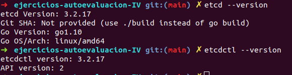
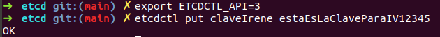
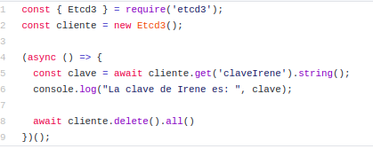
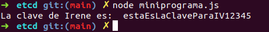

# EJERCICIOS DE AUTOEVALUACIÓN IV - TEMA 6
## MICROSERVICIOS
**Ejercicio 1:** instalar *etcd3*, averiguar qué bibliotecas funcionan bien con el lenguaje que estemos escribiendo el proyecto y hacer un pequeño ejemplo de almacenamiento y recuperación de una clave; hacer el almacenamiento desde la línea de órdenes (con *etcdctl*) y la recuperación desde el mini-programa que hagáis.

Lo primero que debemos hacer es instalar *etcd3* y comprobar que efectivamente disponemos del comando *etcdctl*.

~~~
sudo apt install etcd

etcd --version

etcdctl --version
~~~

A continuación, mediante la línea de órdenes vamos a almacenar nuestra clave.
~~~
npm install --save-dev etcd3

etcdctl put claveIrene estaEsLaClaveParaIV12345
~~~

**Anotación:** antes de establecer nuestra clave debemos hacer *export ETCDCTL_API=3*.

La biblioteca que funciona bien con nuestro lenguaje es *etcd3* y para realizar nuestro [miniprograma](https://github.com/irenecj/ejercicios-autoevaluacion-IV/blob/main/etcd/miniprograma.js), si nos dirigimos a esta [página oficial](https://www.npmjs.com/package/etcd3) vemos un pequeño ejemplo que podemos usar de guía.

Si ahora ejecutamos el miniprograma:
~~~
node miniprograma.js
~~~

Vemos que efectivamente obtenemos la clave establecida:

**Ejercicio 2:** realizar una aplicación básica que use *express* para devolver alguna estructura de datos del modelo que se viene usando en el curso.

Lo primero que debemos hacer es instalar el módulo *express*.
~~~
npm install express --save
~~~

A continuación creamos nuestra [aplicación básica.]()
